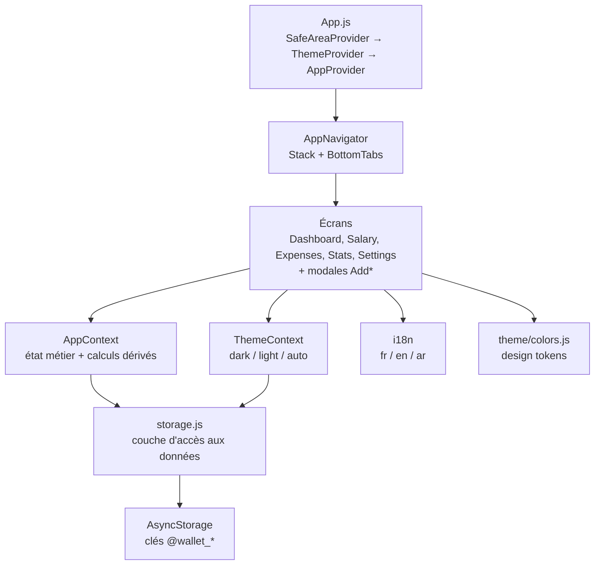
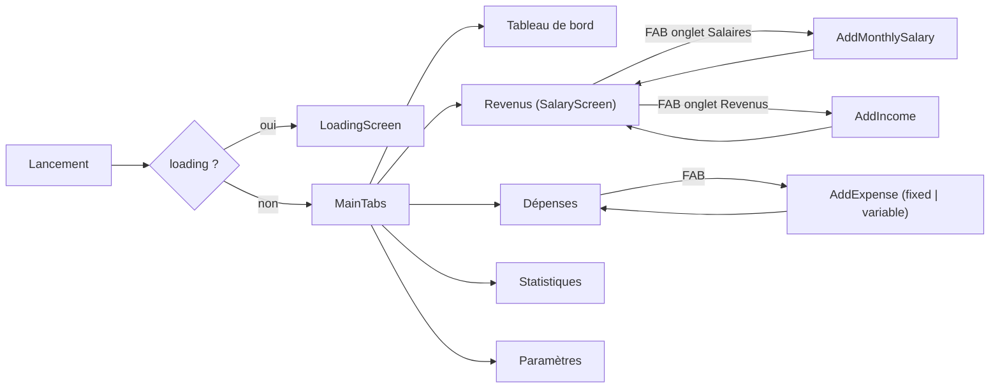
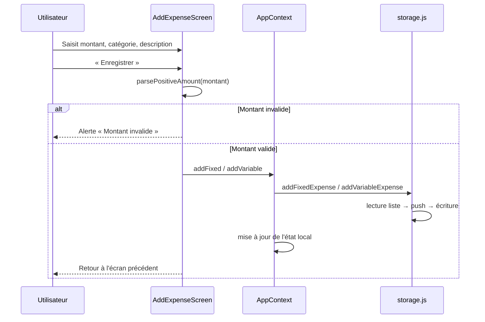
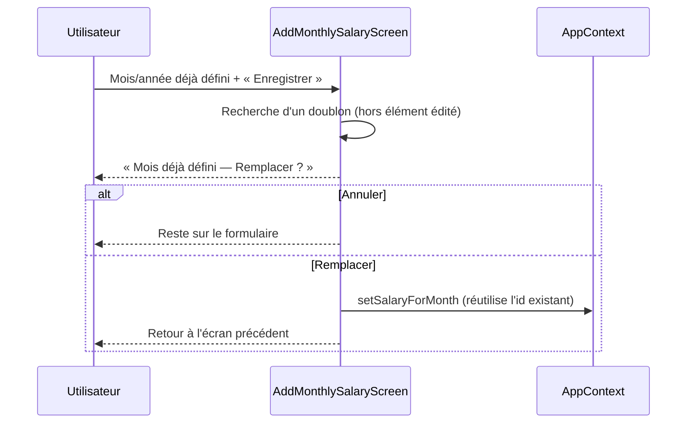

# Wallet — Application mobile de gestion budgétaire

Application **React Native / Expo** de suivi de budget personnel : salaires, revenus
complémentaires, charges fixes, dépenses variables et statistiques. Fonctionnement
**100 % hors-ligne**, données stockées localement sur l'appareil.

> Ce document sert à la fois de guide de démarrage et d'**audit technique** (architecture,
> dette, risques, plan de tests, roadmap).

---

## Sommaire

1. [Démarrage rapide](#1-démarrage-rapide)
2. [Architecture complète](#2-architecture-complète)
3. [Fonctionnalités métier](#3-fonctionnalités-métier)
4. [Flux utilisateur](#4-flux-utilisateur)
5. [Dépendances](#5-dépendances)
6. [Dette technique](#6-dette-technique)
7. [Risques de sécurité](#7-risques-de-sécurité)
8. [Code mort](#8-code-mort)
9. [Plan de tests P0 / P1 / P2](#9-plan-de-tests-p0--p1--p2)
10. [Couverture actuelle](#10-couverture-actuelle)
11. [Roadmap de réduction du risque](#11-roadmap-de-réduction-du-risque)

---

## 1. Démarrage rapide

### Prérequis

| Outil | Version |
|---|---|
| Node.js | >= 18 (`engines` du `package.json`) |
| npm | >= 9 |
| Expo Go | Android / iOS, pour tester sur appareil réel |

### Installation et lancement

```bash
npm install
npm start          # Metro sur le port 8082, affiche un QR code
```

| Commande | Effet |
|---|---|
| `npm start` | Serveur Expo (port 8082) |
| `npm run android` | Ouvre sur émulateur / appareil Android |
| `npm run ios` | Ouvre sur simulateur iOS (macOS requis) |
| `npm run web` | Version web via `react-native-web` |
| `npm test` | Suite Jest complète (`--runInBand`) |
| `npm test -- --coverage` | Suite + rapport de couverture |

> Le port est forcé à **8082** dans tous les scripts, et le fichier `.env` versionné
> surcharge `EXPO_PACKAGER_PROXY_URL` / `RCT_METRO_PORT`. Voir §7.

---

## 2. Architecture complète

### 2.1 Vue en couches



### 2.2 Arborescence

```
mobile-app/
├── App.js                      # Composition des providers + écran de chargement
├── app.json                    # Config Expo (bundle id, plugins)
├── babel.config.js             # Preset Expo + plugin react-native-paper
├── jest.setup.js               # Mock AsyncStorage global + timeout
├── .env                        # ⚠ versionné (voir §7)
├── components/
│   └── HelloScreen.js          # ☠ résidu du template initial
└── src/
    ├── components/
    │   └── LoadingScreen.js    # Splash pendant le chargement initial
    ├── context/
    │   └── AppContext.js       # ★ Cœur métier : état + calculs + mutations
    ├── hooks/
    │   └── useSalary.js        # ☠ non consommé (doublon d'AppContext)
    ├── locales/
    │   ├── i18n.js             # Init i18next
    │   └── fr.js / en.js / ar.js
    ├── navigation/
    │   └── AppNavigator.js     # 5 onglets + 3 modales
    ├── screens/                # 9 écrans (dont 1 inatteignable, voir §8)
    ├── storage/
    │   └── storage.js          # ★ Persistance AsyncStorage (CRUD par entité)
    ├── testSupport/            # Mock AsyncStorage + render avec providers
    ├── theme/
    │   ├── colors.js           # Tokens + DarkTheme / LightTheme
    │   └── ThemeContext.js     # Mode de thème persistant
    └── utils/
        └── money.js            # Validation stricte des montants
```

### 2.3 Modèle de données

Toutes les entités sont stockées en JSON sous des clés `@wallet_*`.

| Clé AsyncStorage | Forme | Champs |
|---|---|---|
| `@wallet_income` | `Array` | `id`, `amount`, `description`, `category`, `date` |
| `@wallet_fixed_expenses` | `Array` | `id`, `amount`, `description`, `category` |
| `@wallet_variable_expenses` | `Array` | `id`, `amount`, `description`, `category`, `date` |
| `@wallet_global_salary` | `Object \| null` | `id: 'global'`, `amount`, `label` |
| `@wallet_monthly_salaries` | `Array` | `id`, `month` (0-11), `year`, `amount`, `label` |
| `@wallet_settings` | `Object` | `language`, `darkMode`, `currency` |
| `@wallet_theme` | `String` | `dark` \| `light` \| `auto` |

> **Incohérence de typage** : `amount` est un `number` pour les revenus/dépenses mais une
> `string` pour les salaires. Tous les consommateurs appliquent `parseFloat`.

### 2.4 Règles de calcul (`AppContext`)

| Valeur dérivée | Formule |
|---|---|
| `currentMonthSalary` | salaire du mois courant **sinon** salaire global **sinon** `0` |
| `totalAdditionalIncome` | somme de **tous** les revenus complémentaires |
| `totalIncome` | `currentMonthSalary.amount + totalAdditionalIncome` |
| `totalFixed` / `totalVariable` | somme de **toutes** les charges / dépenses |
| `balance` | `totalIncome - totalFixed - totalVariable` |
| `budgetUsedPercent` | `min(100, round((totalFixed + totalVariable) / totalIncome × 100))`, `0` si revenus nuls |

---

## 3. Fonctionnalités métier

| # | Domaine | Description | Écran |
|---|---|---|---|
| F1 | Salaire global | Montant mensuel récurrent, avec note optionnelle | `SalaryScreen` (modale) |
| F2 | Salaires mensuels | Montant spécifique par mois/année, détection de doublon avec remplacement confirmé | `AddMonthlySalaryScreen` |
| F3 | Priorité de salaire | Le salaire du mois courant l'emporte sur le salaire global | `AppContext` |
| F4 | Revenus complémentaires | Bonus, freelance, autre — avec catégorie et date | `AddIncomeScreen` |
| F5 | Charges fixes | Loyer, internet, assurance, crédit… (sans date) | `AddExpenseScreen` (`type: fixed`) |
| F6 | Dépenses variables | Nourriture, shopping, loisirs… (avec date) | `AddExpenseScreen` (`type: variable`) |
| F7 | Suppression protégée | Toute suppression passe par une confirmation destructive | Tous les écrans de liste |
| F8 | Tableau de bord | Solde, revenus, dépenses, jauge de budget colorée par seuil | `DashboardScreen` |
| F9 | Statistiques | Répartition par catégorie, revenus vs dépenses | `StatsScreen` |
| F10 | Préférences | Langue (fr/en/ar), devise (6 choix), thème (dark/light/auto) | `SettingsScreen` |
| F11 | Réinitialisation | Efface les données financières, **conserve** les préférences | `SettingsScreen` |

### Règles de validation

- Montant accepté : entier ou décimal positif, virgule **ou** point (`parsePositiveAmount`).
- Montant rejeté : vide, `0`, négatif, non numérique, partiellement numérique (`12abc`),
  notation exponentielle, `Infinity`, `NaN`.
- Les libellés (`label`) sont nettoyés (`trim`) avant enregistrement.

---

## 4. Flux utilisateur

### 4.1 Navigation



### 4.2 Ajout d'une dépense



### 4.3 Salaire mensuel en doublon



---

## 5. Dépendances

### 5.1 Utilisées

| Paquet | Version | Usage |
|---|---|---|
| `expo` | ~51.0.0 | Runtime et outillage |
| `react` / `react-native` | 18.2.0 / 0.74.1 | Socle |
| `@react-navigation/*` | 6.x | Stack + bottom tabs |
| `@react-native-async-storage/async-storage` | 1.23.1 | Persistance |
| `i18next` / `react-i18next` | 23.x / 14.x | Internationalisation |
| `expo-linear-gradient` | ~13.0.2 | Dégradés (Dashboard, Salary) |
| `react-native-safe-area-context` | 4.10.1 | Zones sûres |
| `expo-status-bar` | ~1.12.1 | Barre d'état |
| `react-native-screens` | 3.31.1 | Dépendance de navigation |
| `react-native-web` / `@expo/metro-runtime` | — | Cible web |

### 5.2 Déclarées mais non utilisées

| Paquet | Constat | Action |
|---|---|---|
| `react-native-paper` | Aucun import ; seul `babel.config.js` charge son plugin | Retirer le paquet **et** le plugin Babel |
| `react-native-vector-icons` | Aucun import (icônes = emojis) ; **paquet déprécié** | Supprimer |
| `react-native-svg` | Aucun import | Supprimer |
| `uuid` | Aucun import (ids générés via `Date.now()`) | Supprimer **ou** l'utiliser pour corriger les ids (§6) |
| `expo-font` | Aucune police chargée ; plugin déclaré dans `app.json` | Supprimer des deux côtés |

### 5.3 Décalages de version

`react-native@0.74.1` (attendu `0.74.5`) et `react-native-safe-area-context@4.10.1`
(attendu `4.10.5`) — signalés à chaque démarrage d'Expo.

---

## 6. Dette technique

Classement par impact décroissant.

### D1 — « Ce mois » agrège en réalité tout l'historique 🔴

Le salaire est **mensuel**, mais `totalFixed`, `totalVariable` et `totalAdditionalIncome`
somment **toutes** les écritures depuis l'installation. Le `ExpensesScreen` affiche pourtant
le libellé « Ce mois », et le Dashboard compare un revenu mensuel à des dépenses cumulées.
**Le solde affiché est faux dès le deuxième mois d'utilisation.**
→ Introduire un filtrage par période (mois courant) dans les sélecteurs.

### D2 — Séquences d'échappement littérales dans le JSX 🔴

Dans du **texte JSX**, `\uXXXX` n'est pas interprété (contrairement aux chaînes JS).
8 occurrences affichent donc le code source à l'écran :

| Fichier | Ligne | Rendu actuel | Attendu |
|---|---|---|---|
| `ExpensesScreen.js` | 60 | `\u2715` | `✕` (bouton supprimer) |
| `ExpensesScreen.js` | 106 | `\ud83d\udcad` | 💭 (état vide) |
| `StatsScreen.js` | 113 | `\ud83d\udcca` | 📊 (état vide) |
| `SettingsScreen.js` | 55, 153 | `Th\u00e8me` | `Thème` |
| `SettingsScreen.js` | 77, 119 | `\u2713` | `✓` |
| `SettingsScreen.js` | 87 | `APERçU DU TH\u00c8ME ACTIF` | `APERÇU DU THÈME ACTIF` |

### D3 — Écritures concurrentes non sérialisées 🔴

Chaque mutation fait `lecture → modification → écriture` complète de la liste. Deux ajouts
rapprochés (ou deux écrans) peuvent provoquer une **perte d'écriture** (dernier gagnant).
→ Sérialiser via une file d'attente, ou passer à une base transactionnelle (SQLite).

### D4 — Identifiants basés sur `Date.now()` 🟠

`Date.now().toString()` : deux créations dans la même milliseconde produisent le même id,
ce qui casse `keyExtractor`, l'édition et la suppression. `uuid` est déjà installé.

### D5 — État de thème dupliqué 🟠

`settings.darkMode` (dans `@wallet_settings`) n'est **jamais lu** ; le thème réel vit dans
`ThemeContext` sous `@wallet_theme`. Deux sources de vérité, dont une morte.

### D6 — Erreurs de persistance non gérées côté UI 🟠

Les `handleSave` n'entourent pas les appels d'un `try/catch` : un échec d'écriture
AsyncStorage remonte en rejet de promesse non géré, sans aucun retour utilisateur.

### D7 — Aucune validation des données au chargement 🟠

`JSON.parse` est protégé contre le JSON malformé, mais pas contre un JSON **valide et
structurellement incorrect** (objet au lieu de tableau, `amount` absent). Un `.reduce` sur
un non-tableau ferait planter le provider au démarrage.

### D8 — Arabe présent sans support RTL 🟡

La locale `ar` est proposée, mais `I18nManager.forceRTL` n'est jamais appelé : l'interface
reste en LTR. De plus, le changement de langue n'est pas propagé au sens de lecture.

### D9 — `IncomeScreen` ignore le thème 🟡

Seul écran à importer `Colors` (= `DarkTheme` figé) au lieu de `useTheme()` : il resterait
sombre en mode clair. Écran par ailleurs inatteignable (§8).

### D10 — Duplication de rendu dans `SalaryScreen` 🟡

L'en-tête (gradient + onglets) est dupliqué à l'identique entre la branche `salary` et la
branche `income` (~40 lignes). `SalaryScreen.js` fait 600+ lignes.

### D11 — Imports morts et écran obsolète 🟡

`Colors` importé sans usage dans 4 écrans ; `components/HelloScreen.js` hérité du template.

---

## 7. Risques de sécurité

| # | Risque | Gravité | Détail | Remédiation |
|---|---|---|---|---|
| S1 | `.env` **versionné** et absent du `.gitignore` | 🟠 Moyen | Contenu actuel inoffensif (`EXPO_PACKAGER_PROXY_URL`, `RCT_METRO_PORT`), mais le fichier est suivi par Git : tout secret ajouté demain partirait sur le dépôt distant | Ajouter `.env` au `.gitignore`, `git rm --cached .env`, fournir un `.env.example` |
| S2 | Données financières **non chiffrées** | 🟠 Moyen | AsyncStorage écrit en clair. Sur appareil rooté/jailbreaké ou via sauvegarde, l'historique budgétaire est lisible | `expo-secure-store` pour les données sensibles, ou SQLite chiffré |
| S3 | **Aucun verrouillage** applicatif | 🟠 Moyen | Pas de code PIN ni biométrie : quiconque déverrouille le téléphone voit les finances | `expo-local-authentication` + verrouillage au retour en avant-plan |
| S4 | Chaîne d'outils vulnérable | 🟡 Faible | `npm audit` : **44 vulnérabilités (2 critiques, 12 élevées)**. Les critiques touchent `@expo/config-plugins` et `@expo/rudder-sdk-node`, soit le **build**, pas le bundle livré | Monter de SDK (S5) ; ne pas livrer les outils Expo en production |
| S5 | **Expo SDK 51 obsolète** | 🟠 Moyen | SDK sorti en 2024, hors fenêtre de support : plus de correctifs de sécurité, et les magasins imposent des niveaux d'API récents | Planifier la montée de SDK (voir roadmap) |
| S6 | `react-native-vector-icons` déprécié | 🟡 Faible | Paquet marqué déprécié par l'upstream, et **inutilisé** | Supprimer (§5.2) |
| S7 | Absence de sauvegarde / export | 🟡 Faible | Une désinstallation ou un `resetData` détruit définitivement les données, sans export possible | Export/import JSON chiffré |

**Surface d'attaque réduite** : l'application ne fait **aucun appel réseau**, n'utilise
aucune authentification distante et ne manipule pas de `WebView` — ni injection distante,
ni fuite via API. Le risque est essentiellement **local** (accès à l'appareil).

---

## 8. Code mort

| Élément | Nature | Preuve | Recommandation |
|---|---|---|---|
| `components/HelloScreen.js` | Écran complet | Aucun import dans tout le projet | Supprimer |
| `src/screens/IncomeScreen.js` | Écran complet | **Non importé par `AppNavigator`** — l'onglet « Revenus » affiche `SalaryScreen` | Décider : brancher ou supprimer |
| `src/hooks/useSalary.js` | Hook | Aucun écran ne l'utilise ; duplique `currentMonthSalary` d'`AppContext` | Supprimer (logique déjà centralisée) |
| `updateIncome`, `updateFixed`, `updateVariable` | API de contexte | Exposées mais jamais appelées par l'UI (aucune édition de ligne) | Conserver si l'édition est au backlog, sinon supprimer |
| `reload` | API de contexte | Exposée, jamais appelée | Supprimer |
| `settings.darkMode` | Champ de données | Écrit, jamais lu (cf. D5) | Supprimer du modèle |
| `Colors` (import) | Import inutile | `AddExpenseScreen`, `AddIncomeScreen`, `AddMonthlySalaryScreen`, `SalaryScreen` | Nettoyer |
| `react-native-paper`, `react-native-svg`, `react-native-vector-icons`, `uuid`, `expo-font` | Dépendances | Aucun import (§5.2) | Désinstaller |
| `assets/` | Dossier | Référencé par l'ancien README, **inexistant** ; `app.json` ne déclare ni icône ni splash | Créer les assets avant publication |

> ⚠️ `IncomeScreen.js` dispose de tests (`IncomeScreen.test.js`). Ils sont valides mais
> couvrent un écran **inatteignable en production** : à supprimer avec l'écran si l'arbitrage
> est de ne pas le brancher.

---

## 9. Plan de tests P0 / P1 / P2

### P0 — Bloquant (exactitude financière et intégrité des données)

| Cas | Statut |
|---|---|
| Persistance CRUD des 3 collections (revenus, charges, dépenses) | ✅ couvert |
| JSON corrompu → retour à une liste vide sans plantage | ✅ couvert |
| Échec d'écriture → l'état mémoire n'est pas corrompu | ✅ couvert |
| Priorité salaire mensuel > global > aucun | ✅ couvert |
| Agrégats `totalIncome` / `balance` / `budgetUsedPercent` (dont plafond 100 %) | ✅ couvert |
| Rejet des montants invalides (`0`, négatif, `12abc`, `Infinity`) sur les 4 formulaires | ✅ couvert |
| Suppression uniquement après confirmation destructive | ✅ couvert |
| `resetData` efface les finances et **conserve** les préférences | ✅ couvert |
| Doublon de salaire mensuel → remplacement explicite, réutilisation de l'id | ✅ couvert |
| **Filtrage par mois des totaux** (D1) | ❌ à écrire après correctif |
| **Écritures concurrentes sans perte** (D3) | ❌ à écrire après correctif |
| **Unicité des identifiants** (D4) | ❌ à écrire après correctif |

### P1 — Majeur (parcours et cohérence d'interface)

| Cas | Statut |
|---|---|
| Sauvegarde nominale dépense fixe (sans date) / variable (avec date) | ✅ couvert |
| Bascule d'onglets et ouverture du bon formulaire | ✅ couvert |
| Modale salaire global : pré-remplissage, mise à jour, annulation | ✅ couvert |
| Persistance langue / devise / thème | ✅ couvert |
| Mises à jour concurrentes de préférences sans écrasement | ✅ couvert |
| Thème : dark / light / auto + rechargement persistant | ✅ couvert |
| Agrégation des statistiques par catégorie, catégorie par défaut | ✅ couvert |
| États vides (dépenses, revenus, salaires, statistiques) | ⚠️ partiel |
| Rendu correct des icônes et libellés (régression D2) | ❌ à écrire |
| Branches `Platform.OS === 'web'` (`window.confirm`) | ❌ à écrire |

### P2 — Secondaire (robustesse et qualité)

| Cas | Statut |
|---|---|
| Rendu RTL en arabe | ❌ |
| Volumétrie (500+ écritures) et performance des listes | ❌ |
| Accessibilité (labels, contrastes, tailles de police) | ❌ |
| Snapshots visuels dark/light | ❌ |
| Parcours bout-en-bout sur appareil (Detox / Maestro) | ❌ |

---

## 10. Couverture actuelle

Mesure réelle (`npm test -- --coverage`) : **14 suites, 136 tests, tous au vert**.

| Périmètre | Instructions | Branches | Fonctions | Lignes |
|---|---|---|---|---|
| **Global** | **95,83 %** | **81,84 %** | **93,19 %** | **96,83 %** |
| `storage/storage.js` | 100 % | 100 % | 100 % | 100 % |
| `utils/money.js` | 100 % | 100 % | 100 % | 100 % |
| `context/AppContext.js` | 99,24 % | 71,87 % | 100 % | 100 % |
| `hooks/useSalary.js` | 100 % | 85 % | 100 % | 100 % |
| `screens/` | 92,60 % | 81,08 % | 88,17 % | 94,42 % |
| `theme/ThemeContext.js` | 91,66 % | 69,23 % | 85,71 % | 96,42 % |

### Lecture critique de ces chiffres

La couverture est élevée, mais elle mesure le **code exécuté**, pas la **justesse métier** :

- Le défaut D1 (périmètre temporel) est couvert par des tests… qui **valident le comportement
  erroné**. Une couverture forte ne protège pas d'une spécification fausse.
- Les branches non couvertes sont principalement les variantes `Platform.OS === 'web'` des
  confirmations (`ExpensesScreen` 31-32, `SettingsScreen` 29, `SalaryScreen`), qui exigent un
  environnement de test web distinct.
- Le rendu visuel n'est pas vérifié : c'est pourquoi le défaut D2 (`\u2715` affiché tel quel)
  a traversé la suite sans la faire échouer.

### Convention de test

Seules les **frontières externes** sont simulées : AsyncStorage (`src/testSupport/asyncStorageMock.js`),
la navigation et les dialogues natifs. Les providers, la couche de stockage et i18n sont
**réels**, ce qui permet d'affirmer qu'une donnée a bien été persistée plutôt que de vérifier
qu'une fonction a été appelée.

---

## 11. Roadmap de réduction du risque

### Jalon 1 — Corriger ce qui est faux (priorité absolue)

| Action | Cible |
|---|---|
| Filtrer les totaux sur le mois courant, ou renommer les libellés | D1 |
| Corriger les 8 séquences `\uXXXX` du JSX | D2 |
| Sérialiser les écritures AsyncStorage | D3 |
| Identifiants via `uuid` | D4 |
| Ajouter `.env` au `.gitignore` + `git rm --cached .env` + `.env.example` | S1 |
| Tests de régression P0 associés | §9 |

### Jalon 2 — Assainir

| Action | Cible |
|---|---|
| Supprimer le code mort (`HelloScreen`, `useSalary`, `reload`, `settings.darkMode`, imports `Colors`) | §8 |
| Arbitrer `IncomeScreen` : brancher ou supprimer (avec ses tests) | §8 |
| Désinstaller les 5 dépendances inutilisées + plugin Babel Paper | §5.2 |
| Aligner `react-native` et `react-native-safe-area-context` | §5.3 |
| `try/catch` + retour utilisateur sur toutes les sauvegardes | D6 |
| Validation de schéma au chargement des données | D7 |

### Jalon 3 — Sécuriser

| Action | Cible |
|---|---|
| Migrer les données sensibles vers un stockage chiffré | S2 |
| Verrouillage biométrique / code PIN | S3 |
| Export / import chiffré des données | S7 |
| Montée de version Expo SDK (résorbe les vulnérabilités critiques) | S4, S5 |

### Jalon 4 — Durcir et industrialiser

| Action | Cible |
|---|---|
| Support RTL réel pour l'arabe | D8 |
| Découper `SalaryScreen` et factoriser son en-tête | D10 |
| Tests P1 restants : rendu des libellés, branches web | §9 |
| Intégration continue : `npm test` + seuils de couverture bloquants | — |
| Tests bout-en-bout (Maestro / Detox) sur les parcours P0 | §9 |
| Créer les assets (icône, splash) et compléter `app.json` | §8 |

---

## Annexe — Commandes utiles

```bash
npm test                          # Suite complète
npm test -- --coverage            # Avec rapport de couverture
npx jest src/context              # Cibler un dossier
npx jest -t "budget"              # Cibler par nom de test
npm audit --omit=dev              # Vulnérabilités hors outillage de dev
```
